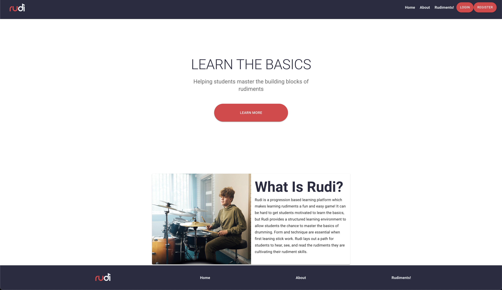
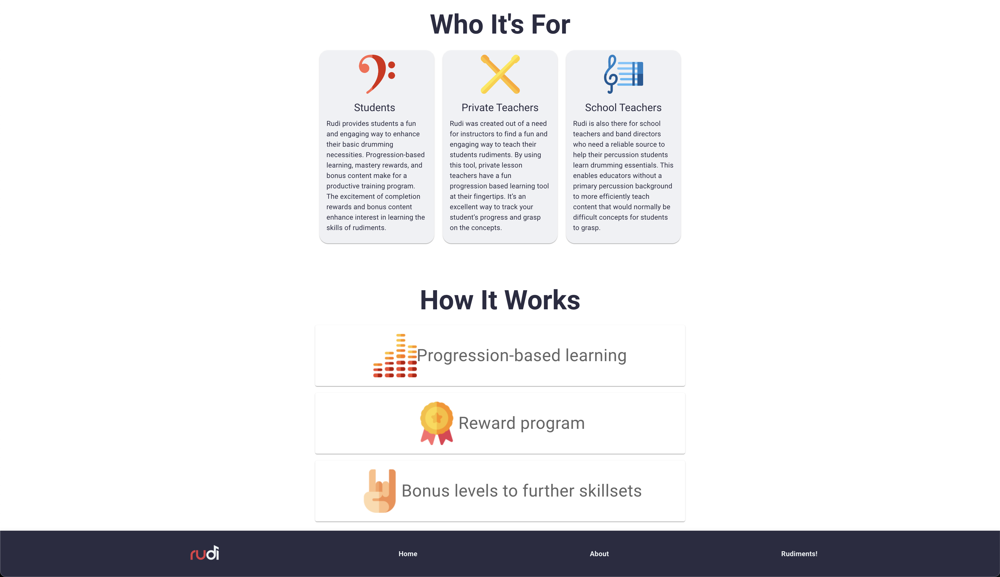
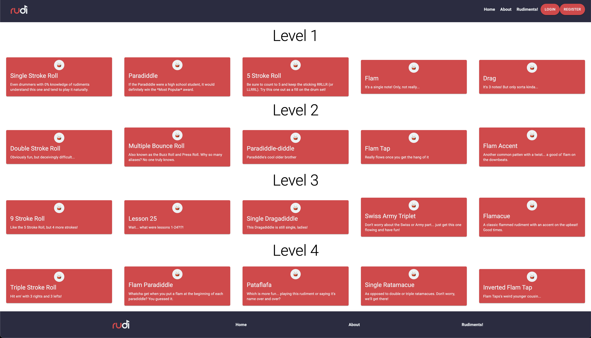
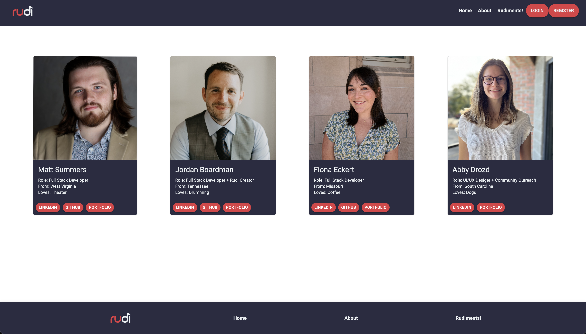

# Rudi

Rudi is your one stop shop for the best (and most fun) way to learn your rudiments if you're a drummer/percussionist. This app is meant to be your best resource when going through the learning process and Rudi provides a fun gamified way to traverse through your rudiment journey. Rudi is perfect for teachers as well, as it helps provide a structure for fun efficient learning for your students. Enjoy!

## Tech Stack (PERN)

- **P**ostgresSQL
- **E**xpress
- **R**eact.js
- **N**ode

## Other Technologies Used

- JavaScript
- Material UI
- Bcrypt
- Git
- Github
- JIRA
- Adobe XD

## UI Design

- Abby Drozd | https://www.abbydrozddesigns.com/

## MVP

- Display Home, About, and Rudiments page.
- Display Login and Registration pages.
- Successfully POST to the databases.
- Successfully create a simple UX.
- Implement as much responsiveness as possible.
- Meet minimum project requirements.

## Screenshots of Rudi

## Developer Team

- Matt Summers - [Github][1]
- Fiona Eckert - [Github][2]
- Jordan Boardman - [Github][3]

[1]: https://github.com/msummx
[2]: https://github.com/fionaeckert
[3]: https://github.com/jordanboardman
